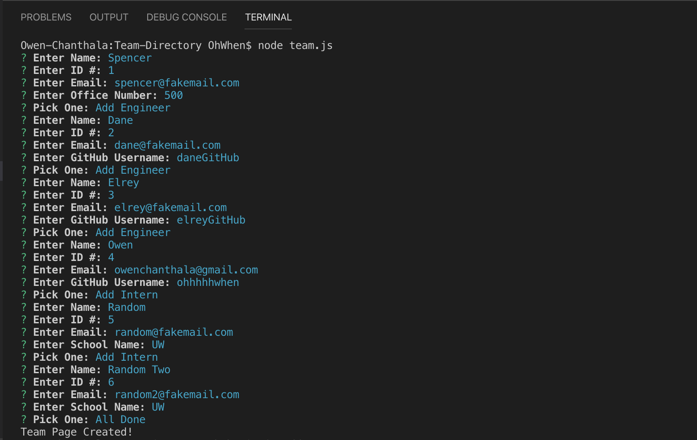
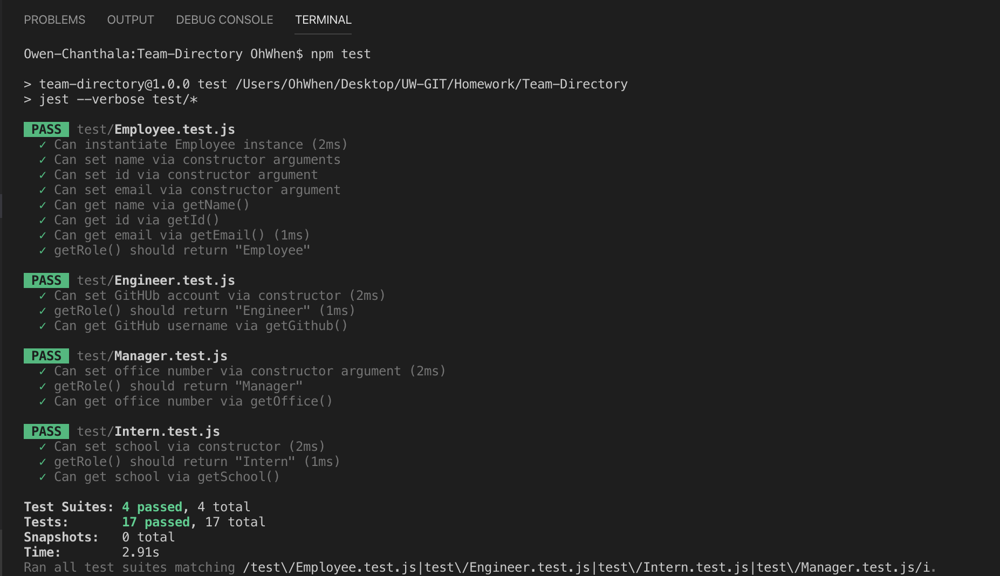
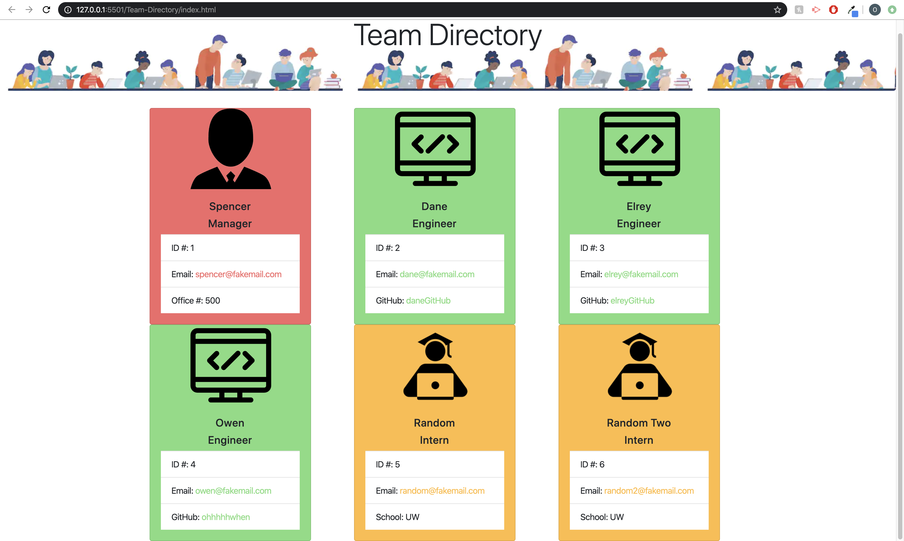

# Team-Directory

## Table of contents
* [Deployed Repo](#deployed-repo)
* [Assignment Info](#assignment-info)
* [Technologies](#technologies)
* [Files / Running Pages](#files/running-pages)
* [Key Notes](#key-notes)

## Deployed Repo
* HTML
 https://ohhhhhwhen.github.io/Team-Directory/

## Assignment info
Within javascript files, used functions to make an instance
of a desired class. Starting off with a prompt that has a manger
fill in information, then asks them to fill in info for either an 
engineer or intern, depending on what they're team is like. Each prompt
inputs are stored with an array as their on objects. Looping through the 
array once they're done creating their team. Distinguishing between classes
and how to arrange their info. Once all members have been defined, a writeFile 
function is called to create the final HTML team page.
	
## Technologies
Project is created with:
* Bootstrap v4.4
* Visual Studios Code (HTML/CSS/JS/JQ)
* Google/W3
* Node.js
* Express
* NPM
	
## Files / Running Pages
* Here are some screen shots of the running page from an images folder:

 

 

 


## Key Notes
* Bootstrap link for html format

```
$ <link rel="stylesheet" href="https://stackpath.bootstrapcdn.com/bootstrap/4.3.1/css/bootstrap.min.css"
        integrity="sha384-ggOyR0iXCbMQv3Xipma34MD+dH/1fQ784/j6cY/iJTQUOhcWr7x9JvoRxT2MZw1T" crossorigin="anonymous">
```

*  NPM
- install
- require
- inquirer
- lfs 
- jest
- nodemon
- test